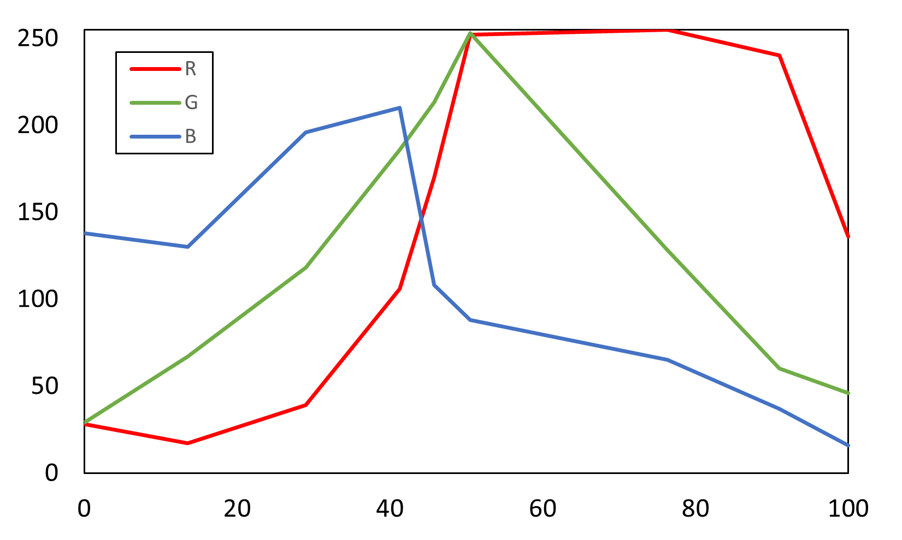
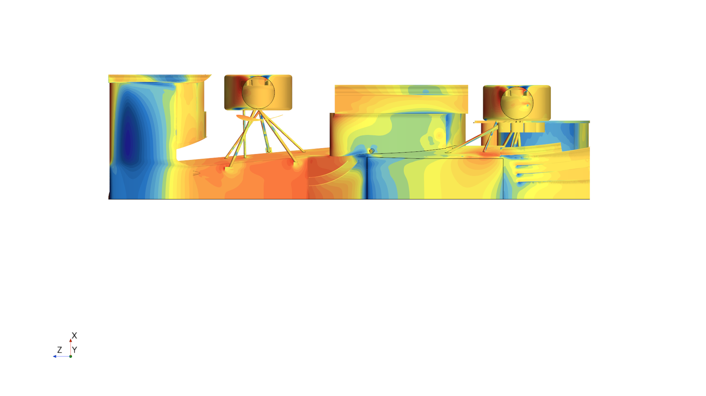
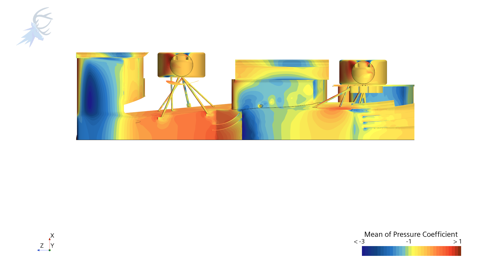
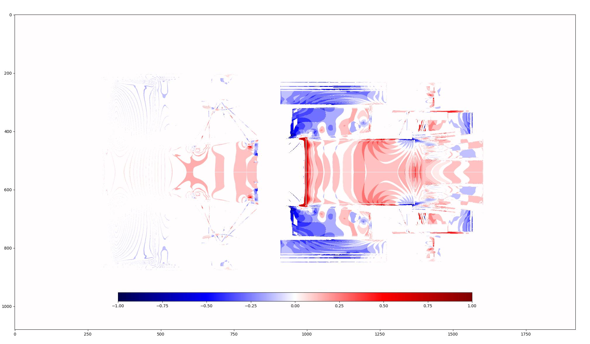

# Delta plot generator

## General
This code was developed to get the delta plot mainly for CFD surface plot picture.

## packages dependency
This code uses following package.
- numpy
- matplotlib
- csv
- cython 0.29

## Cython Install
Cython is used to accelarate coding.
Before run main.py, install the cython with following command.

      python setup.py build_ext -i

## Usage
The all the file required is given in the folder, including the 2 different surface plot picture.
The colormap is extracted from STARCCM+ "blue-yellow-red", and the data is sorted in CSV.
The different colormap shows the different RGB distribution, so that if the picture the user focusing on uses the different colormap, you have to generate another csv file, on the same format. The csv file format is given as shown in below. In this case, datasize should be 101, since it includes 101 data series. The more data, the more accurate, but takes a bit longer.

|Data|R:0-255|G:0-255|B:0-255|
|----|--------|-------|-------|
|0  |128|12|78|
|1|...|...|...|...|
|...|...|...|...|
|100|...|...|...|

Fig 1 shows the STARCCM+ colormap RGB distribution.
This kind of RGB distribution makes easy to optimise the code.

|  | 
|:--:| 
|<b> Fig.1 - RGB distribution </b> |

## example
The dataset given in the repository shows fig.2 and fig.3 as input and output fig.4.
Users can use colormap whatever he/she wants, including the colormap used in input picture.
However, in this case, the "seismic" is chosen since I want 0 to be white.

      
|  | 
|:--:| 
|<b> Fig.2 - baseline </b> |
|  | 
|:--:| 
|<b> Fig.3 - comparison </b> |
|  | 
|:--:| 
|<b> Fig.4 - Output </b> |
      

